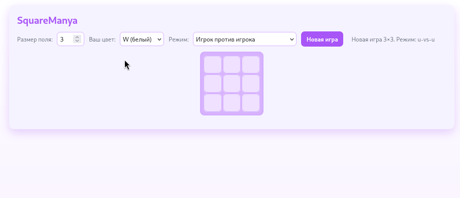

# SquareManya

SquareManya — это игра "Квадраты", реализованная в рамках тестового задания.  
Игроки по очереди ставят фишки белого (`W`) и чёрного (`B`) цветов на поле размером N×N.  
Побеждает тот, кто первым составит квадрат из фишек своего цвета (ориентация квадрата может быть любой).  
Если поле заполнено, а квадрат не собран — объявляется ничья.



---

##  Структура проекта

- **engine/** — движок игры (консольное приложение).
- **service/** — REST API сервис на базе Jersey + Jetty.
- **web-ui/** — веб-интерфейс на чистом JavaScript (vanilla JS), CSS и HTML.
- **docker-compose.yml** — запуск сервисов в Docker.

---

## Запуск проекта

### Docker Compose (рекомендуется)

Требуется установленный **Docker** и **Docker Compose**.

```bash
git clone https://github.com/Barahlushik/ivk-square-manya.git
cd IVK
docker-compose up --build
```


После запуска будут доступны:

- REST API сервис → http://localhost:8080/api/game/move
- Web UI → http://localhost:8081

